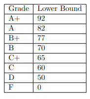
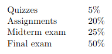
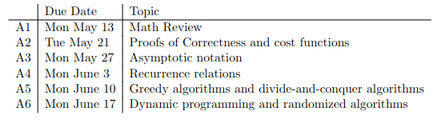

# COMP 2080
- Instructor:  Tim Zapp,   They/them
- Email: zappt3@myumanitoba.caS
- Office hours Mondays and Wednesdays 12:00pm-1:30om in EITC E2-409 (subject to change)

- Readings are required, videos if want
- 9 quizzes on UM Learn
    - two attempts for each
    - targeted from readings
    - deadlines are just end of semester
- 6 Assignments
    - one per week
    - typically due Mondays
    - no assignment extensions
- Midterm May 23
    - 70 minutes

### The following books are recommended
- Introduction to Algorithms, third edition, by Cormen, Leiserson, Rivest, and Stein, MIT
Press, 2009.
- Algorithms, by Dasgupta, Papadimitriou, and Vazirani, McGraw Hill, 2008

## Other
- no curving, but if course is difficult, then will compensate :)

