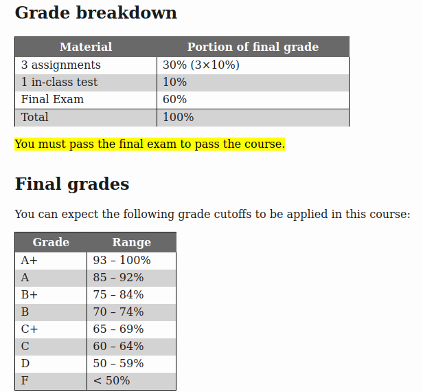

# COMP 2160 Information
- Instructor: Franklin Bristow
- Emal: franklin.bristow@umanitoba.ca
- Office Hours: T/TH 2:00pm-3:00pm or by apponitment in E2-418

## Grading
- Midterm May 24 during class time
- 3 Assignments, due:
    - Friday May 17th at 4:00pm
    - Friday May 31th at 4:00pm
    - Thursday June 13th at 4:00pm

## Textbooks
- **Required:** Introduction to Programming Practices by David Scuse, Department of Computer Science, University of Manitoba.
- **Optional:** Programming Pearls, second edition by Jon Bentley, Addison Wesley, 2000. ISBN: 9780201657883
- **Optional:** The C Programming Language, Second Edition by Brian Kernighan and Dennis Ritchie, Prentice Hall, 1988. ISBN: 0131103628

