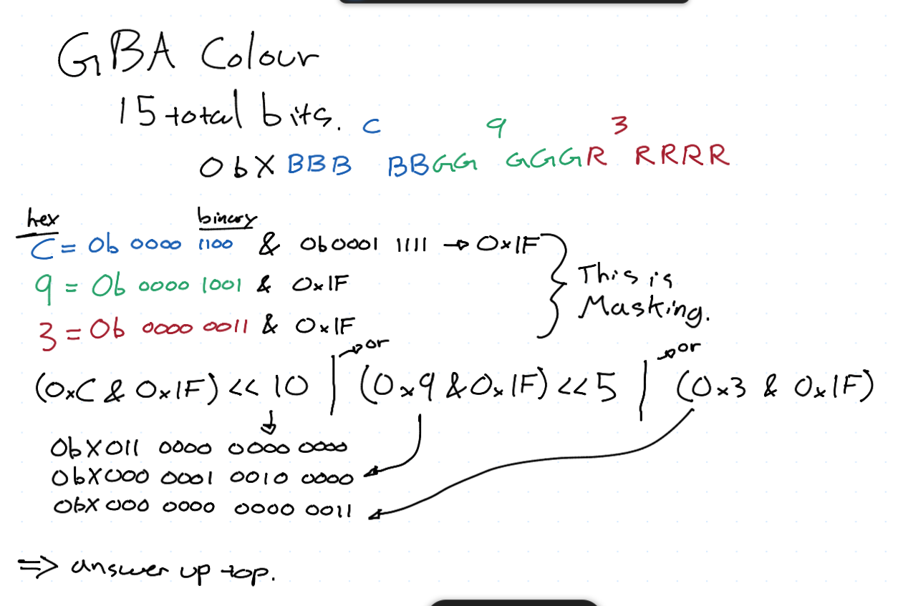

## Notes:
- Gonna look at Search.java and game.c
- Be able to give appropriapte data structure, algorithms, optimisations, etc.
- gonna look at low level code rather than high level optimization today
    - packing bits of data into a byte for example
- Describe benefits of modularity, coupling, cohesion
- Use function pointers to paramaterize behaviours.
    - emulate O-O in C

## Compression Notes Highlight
- trading computing power and time for compression.
- processing power for space.
    - power for space: interesting.
- space for quality
- readablility for compression, but not really.

Namely: Time and Energy taded for compression.

## Manipulating Bits
- All values are ultimately represented in memory as bits.
- Any bit manipulation should be done using unsigned variables.
    - unsigned char is a single byte. ?
    - can't be negative, get bigger numbers.
    - oveflow to zero, cool
    - reliable bit manipulation
        - Arithmetic not affected by sign.

## Masking
- Operators to manipulate bits ina single variable
- bitwise logical operators
    - `&`, and
    - `|`, or
    - `^`, xor
    - `~`, unary 1's compliment, flips the bits, like not operator
    - `<<`, left shift
    - `>>`, right shift

| Decimal   | Hexadecimal | Binary  |
|-----------|-----------|-----------|
|    0      |     0     |     0000  |
|    1      |     1     |    0001   |
|    2      |      2    |    0010   |
|    3      |      3    |    0011   |
|    4      |      4    |    0100   |
|    5      |      5    |    0101   |
|    6      |      6    |    0110   |
|    7      |      7    |    0111   |
|    8      |      8    |    1000   |
|    9      |      9    |    1001   |
|    10     |     A      |   1010    |
|    11     |     B     |    1011     |
|    12     |  C     |       1100     |
|    13     |  D     |       1101     |
|    14     |   E        |   1110     |
|    15     |    F       |   1111     |

## Masking Example
- colour on gameboy is encoded with 15 bits, 5 bits per colour
- so we can use fewer bits to represent colour.

## Masking Example 2
- can do lossless compression on genetic data by packing 4 bases into a single byte.
- ACII character is 8 bits, 
    - 4 characters for A, C, T, G, we want one bit for all 4.
- want to compress, use <<, then decompress use >>. 

skip but fields

## Coupling and Cohesion
- analyze search.java and game.c
- how cohesive (how much do each part of this code interrelated, does one thing verywell)
- tight/high coupled, or loosely/low. (tightly means relies on internal implementation)
- Tell if high or low, and with what?
- How would we change this code sample to make better (cohesion, coupling)

**Search.java**
- Not super cohesive, two separate operations.
    - main reads a file to populate dictionary, one operation
    - alos, searching for a collection of words in the dictionary.
    - so, it reads and searches, not one thing.
    - to increase cohesion by separating these into two classes, or two methods.
        - a dictionary loader and a dictionary searcher,
        - if methods, class still isn't cohesive, but the methods themselves are.
- loose coupling with ADT Dictionary
    - ADT gives operation, doesn't tell about how things are done.
    - can switch out arraylist and hashset, worked fine.
    - so interchagabbility is high, so coupling is loose with Dictionary ADT.
- tightly coupled with a dictionary being a list of words in file.
    - cannot change input file with two words on each line, will mess it all up.

**game.c**
- file in its entirety is not super cohesive
    - does lots of different operations, all game functions.
- high coupling with curses
    - depends on it, really needs it.
- low coupling with zones
    - just have ADT and know it works, can switch out.

if to refactor, take function structure and change it. To do this, take handle keyboard and isplay room out and put in own library. Also, take main function and put into own file, main.c, where game is only responsible for having funciton. If to remove then does not rely tightly on curses.

