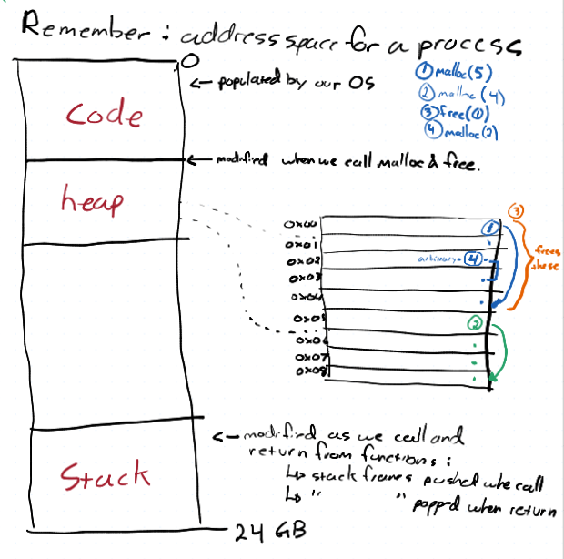

## Notes:
- First fit memory allocation, run time stack, the heap, and garbage collection.

## `void*` (void pointers)
- arrays are addresses
- pointers are variables where the value is an address
	- The pointers type tells what to find at that address
- a void pointer is a varibale that contains a typless address.

## mallac
- `void *malloc(size_t size)`
	- malloc uses void pointer.
	- returns address that specified number of bytes

## void example
- cast void to `(char *)` for example
- buffer has same address but is void pointer
- internal has same address, but is char, has value.
- internal += 2 changes internal's address up two.
- if cast buffer after change internal, shows char contents.
- basically you can cast pointers

## Assignment 3
- Implement interface like malloc, called zalloc, own memory management
- Zone base memory management
	- Interface says allocate zone with bytes
	- then allocate within zone as program runs.
- can release individual chunks when done, or whole thing when done.
- make zone
	- make zone of certain bytes size
- zalloc, allocate number o fbyts in specified zone
- block size, given zone, heare is address returneds, here is size ??
- zone size, how many bytes does zone manage
- zfree, to deallocate pointer from zalloc
- destroy_zone, free all memory in a zone, allocated or not
- zdump, prints all structures in zone.
- will have to use malloc, only 3 calls to malloc
	- allocate zone object
	- track metadata of zone in linked list
	- call malloc fro node to create
	- zalloc must be first fit policy
- ensure to privatize invariates and what have you with static
- also DBC.

#### Q2
- test harness for zone
- like a2, different tests.

#### Q3
- given test cases from franklin, c files, use provided interface, expect all to pass, thoroughly evaluated. Can add to own test suite if want, but get these later, work on yours now.
	- each test case worth 4 points, are point parts
		- correctness and memory leaks. valgrind should leak for each case.

- each node has address to zone ?? or other.
- 3 mallocs in code

## Designeming a Zone-Based Memory Manager
1. Ground rules for our memory manager
2. What the memory manager needs to know 

### Ground Ruels
- our memory manager is responsible for all memory management
	- clients done use malloc
- Memory maanger tracks metadata fro allocated memory
	- can be in the heap in (like the nodes for list)

### Need to know
- which memory has been allocated, have list to see what is allocated by zalloc
	- a client will call our function
	- track addresses given out.
- Memory the client has not allocated, can figure this out by using above.
- What to destroy when the manager is destroyed

### How does malloc track address given out?
- applies best fit memory management for large allocations
	- hmmm
- for small, caching, 
- in between, guess which to use.

