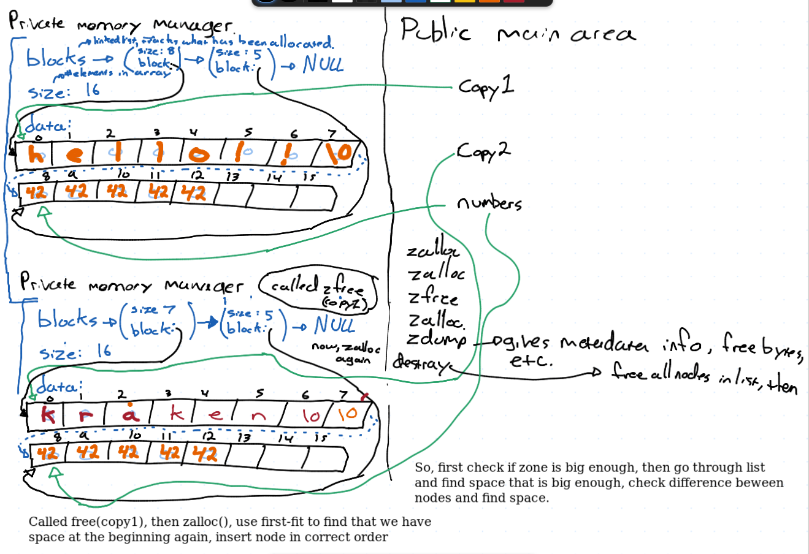

## Notes:
- describe first-fit memory allocation, then specifically zone based.
- lifetime of values on stack v.s. heap

## Allocation Polcies
- memory manager use policies:
    - best fit
    - worst fit
    - first fit
    - next fit

## First-fit
- if have chunk of memory and metadata of if, linear search find first free space big enough to satify what we need to allocate. Or get to end and can't satisfy

use malloc to make a zone
use malloc to make a subzone
- zalloc returns NULL if not enough free space
- unsigned char is always one byte

choose unsigned char for data variable

test case: enough free space but not contiguous, hint hint.

## Sharing Data Between Files
- In java, could have two classes and share public variable between them
- Can do in C as well, how?

### extern
- Declare variable of file scope and use in other files

1. Declare and define variable in first file we are trying to work with

`int var = 9;`

2. Declare in second file without defining, and the extern modifier

`extern var;`

### DO NOT DO THIS. why?
- is it because the whole file must be public then?
- exposes implementatin details.
- High coupling, more on this later

we wont be doing garbage collection in this course
