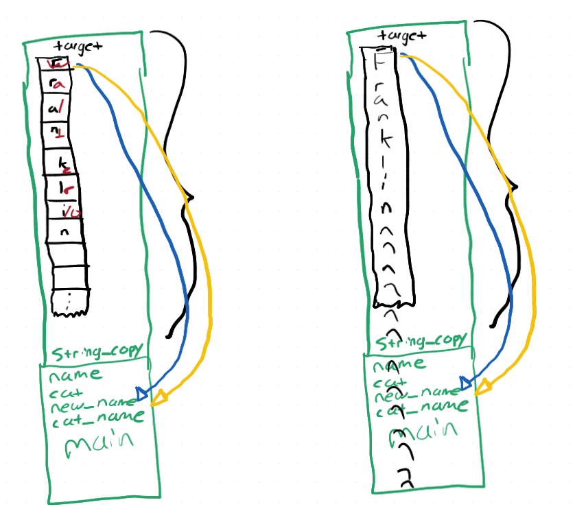
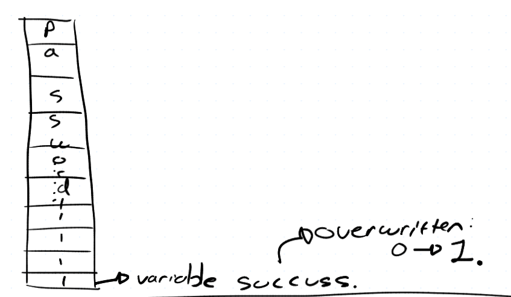

## Pointers
- `int *val`   --> value at this address is an integer
- can be returned from arrays

## Calling a Function
- when called a new frame is added to the stack with room for allvariables in the stack
- the machine executes cod in that function
- on return, frame is popped off the stack
    - What happens to values on the stack depends on your OS




## Why scanf is bad
- doesn't check to see how long it should copy
    - can overwrite imprtant variables
- blindly writes to array
- fgets takes argument to say how much to read in.




# input and output streams

## Standard Input
- typically from keyboard
- files
- output of other programs
- olther devices

in Java:
```java
final Scanner sc = new Scanner(System.in);
```

in C: stdin does the same

## Standard Output
- typically the screen, the terminal
- Files
- Input of other programs
- Printer
- Other devices

## Redirection Operators
- <  for input
    - `./myProgram < file.txt`
- so we can read from file with stdin
- >   for output
    - `./my_printing_program > output.txt`
- can write to file by calling printf
- |  to pipe program output to input of other program
    - `./program1 | ./program2`
        - here, the programs are running at the same time...but that for diff course


