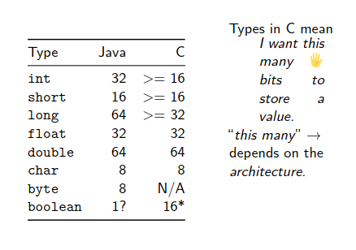

# Comparing Languages
1. Look at the programming paradigm
    - Logical, functional, procedural
    - C, Python, Java/Processing are **all** procedural

2. Look at small differences and similarities
    - Primitive data types
    - Declaring variables
    - Control structures

3. Look at big differences and similarities



## Declaring Variables
- C has unsigned variants of numbers (and characters)
    - unsigned means strictly positve and twice as long in that positive direction
    - `unsigned int num3 = 42`

## Control Structures
- C has no boolean type
    - you can use any variable in places of a boolean expression
    - 0 -> false,   !0 -> true
```c
// iterates until i is zero, prob not perfect practice.
int i = 3;

while(i) {
    i--;
}
```

## Libraries
- Small: use #include instead of import
- Big: "header files" (.h) only *declare* a function

# Bigger Differences From Java

## Declariong Variables
- do not need to initialise variable in C before use
- uninitialised variables are **not** guaranteed to be 0.

## Arrays
1. Arrays are **not** objects (..nothing is an object in C)
2. Arrays are (probably) **not** initialised to zero (depends on OS)
3. Arrays are not bounds checked (arr[-1] is valid)
4. Arrays can be different memory regions
    - arrays are stack allocated in C

### In Java
- Arrays and objects are heap allocated
- primitive types are stack allocated


### A Must.
```c
int main(void)
{
#define ARR_SIZE 10    // no semicolon or equal sign
    
    int arr[ARR_SIZE] = {0};   // initialise it to something known, assigned to all elements
}
```
- as long as done before used
- also must set array to zero using shorthand.

## Memory
- memory is like a giant array
    - Declaring an array gives you access to "contiguous" memory in C and Java
    - **Contiguous** elements physically next to eachother

## Exceptions
- C does not have exceptions
- You will learn to hate Segmentation Fault

## Strings
- strings are arrays of characters
- don't know own length
- no methods
- Strings are not immutable, we can change anything in it
- Strings cannot be assigned like they can in java
- Can be declared as arrays or pointers
- the last element is the NULL byte: '\0', signifies end of string
- typically pass the length as a parameter.

## (basic) Functions
- functions must be "forward declared"

