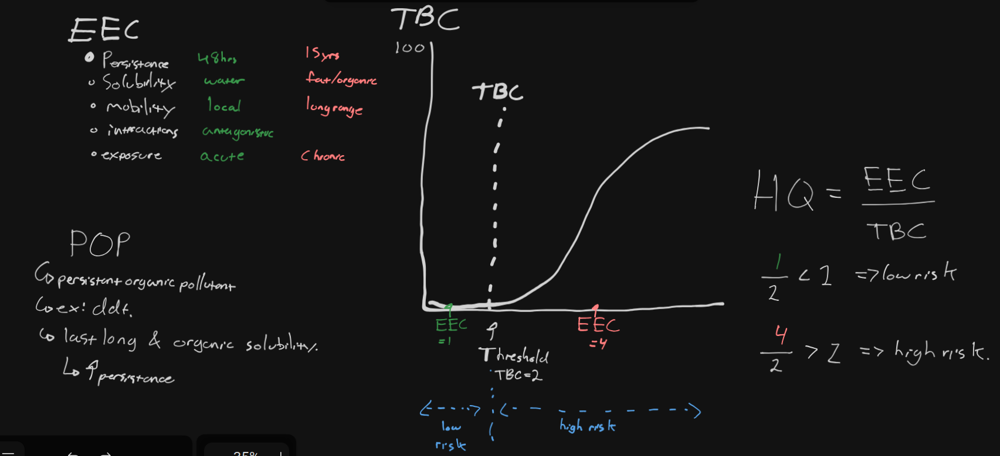

**Toxicology** - study of poisons/toxins and their effect on organisms

*toxins can be synthetic or natural*

**Environmental (Eco)Toxicology**

- toxicology and investigation of environmental factors influencing exposure dynamics
- How does the substance behave in the environment?
- Does the substance undergo transformations that affect how poisonous it is?
- What are the indirect influences on the various biotic interaction in an ecosystem

# Toxins and Pest Management
- toxins used in pesticides (an antibiotic)
- **What is a pest?**
	- an undesirable competitor, parasite, or predator that interferes in some way with human welfare or activities. It could still have an important connection within the ecosystem

# Factors that Affect Toxicity of Substances in the Environment
- **Persistence** - how long a chemical takes to break down in the environment
	- long persistence is bad, interacts more with ecosystem
- **Solubility** - Ability of a chemical to dissolve in liquid
	- **Water-soluble** can be excreted from your body
		- However, water soluble chemicals may easily enter and accumulate in aquatic ecosystems
	- **Fat-soluble** chemicals are absorbed into fatty tissues and there is potential of build up in bodies, can't rid it
		- **organic is fat-soluble**, like organic mercury, or carbon

# Factors that Affect Toxicity
- **Bioaccumulation**
	- Build-up of persistent fat-soluble chemical in body over time
- **Biomagnification of the toxin in the food-web**
	- Leads to concentration in each trophic level
	- animals higher on food chain accumulate more toxins

# Factors that Affect Toxicity
- **Acute Exposure**
	- Symptoms develop fast
	- includes exposure to large amounts of a chemical

- **Chronic Exposure**
	- takes place over long period of time of prolonged exposure
	- often low level pollutants

**Antagonistic Effect**
- these are chemicals that interact to cancel out or lessen the toxicity effect

**Synergistic Effect** 
- combining these toxins results in a pronounced effect and much greater response than would be expected

# Mobility of Toxicants
- Toxicants go to unintended places... duh
- **Broadcast Spraying** - Via planes
    - low % reaches target
    - 98% ends up in air surface water, groundwater, bottom sediments

# Long Range Transport of Pollutants
- thousands of km
- tend to go to Arctic - **"Grasshopper Effect"** 
	- leap to poles with **convective currents**
		- also means that pollutants descend in Canada from elsewhere (US)
- Transported by wind/convection, water/ocean

# Indirect Ecotoxicological Stresses
- quality of habitat, food
- kill predators --> rapid pests 

# Genetic Resistance/Tolerance
- Mutant individuals become resistant over repeated exposure, evolution
- Over time they become majority of population
	- Rebound: after pesticide, mutants multiply/reproduce
- New or more pesticides required

# How Do We Manage Toxins?
- Conduct Risk Assessments
	- 1. Hazard Identification - not too important
	- 2. Dose-response assessment
		- in lab
	- 3. Exposure assessment
		- in environment
		- Persistence, solubility, mobility, interaction, exposure
	- 4. Risk characterisation
		- bring steps 2 and 3 together - get Hazard Quotient
- **Risk:** probability that an activity or exposure to a substance will be harmful

# Dose Response - Step 2
- **Dose**: amount that enters body
- **Response:** type and amount of damage
- **Lethal Dose:** causes death - **LD50** lethal to 50% of population
- **Sub-lethal Dose:** has measurable effect
	- **Effective Dose:** want **ED50** - cause 50% population to exhibit specific response

## Dose Response Curve

- choose dose where ED50 - Effective Dose
- notice low slope of no response at start until Threshold Level
	- Can use up to Threshold Level to not affect certain organism
		- Ex: Kill pest but not fish.
	- Not all chemicals have this.
- Start with high doses and work way down to LD50 and ED50
- Quantify the **threshold level**: Max dose with NOEL, no observable effect

# Risk Characterisation - Step 4 - Hazard Quotient (HQ)

- **EEC**: expected environmental concentration - from step 3
	- 
- **TBC**: toxicological benchmark concentration - from step 2
	- usually the threshold on the graph, or ED50

- HQ > 1  -->  BAD
- HQ < 1  -->  GOOD

# Stockholm Convention
- trying to remove harmful chemicals such as POPs
	- now PCBs are a concern, spilled everywhere, never again

# Example
- DDT
	- last 15 years, is bad, it kills
	- **persistent organic pollutant (POP)**, bioaccumulates and magnifies
	- concentrates over time and in food web
	- Mobility - threat of concentrating in an area
	- Exposure - chronic
	- **High EEC** - in range far right on graph, bad
- Green chemical - good
	- Persistence - 48 hours
	- Water soluble, excretes from kidneys
	- Mobility - local drift
	- Exposure - don't have to worry - acute
	- Interactions - antagonistic: cancels out, need much higher dose before response
	- **Low EEC** - in range left of threshold, good

# Mercury Toxicity
- naturally occurring, can't control 
- 2 Forms:
	- inorganic: liquid silverly metal
		- highly toxic, but not deadly
	- Methylmercury - organic/fat soluble
		- deadly, acquire from eating sea animals
		- humans release through industrial activities
			- then accumulate at sea floor
			- bacteria in mud transform it to methylmercury
		- **Minamata disease** - mercury poisoning, first in Japan

# Mercury in Arctic
- Mercury deposited in Arctic through convection and ocean.
- Takes protein from the ocean.
- Effects worsened through biomagnification
