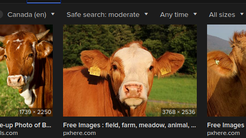
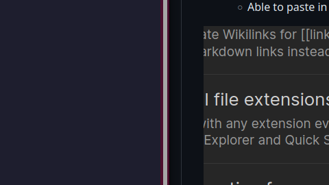

# To Do List for Laptop Ubuntu Perfection
- [ ] PDF Viewer 
	- Tabbed PDF's with commands
	- Seamless scrolling between pages
	- Looks good
- [ ] DrawBoardPDF Alternative 
- [ ] NeoVim Live-Preview *with* images
    - Able to auto insert bullet points
    - Able to paste in images

